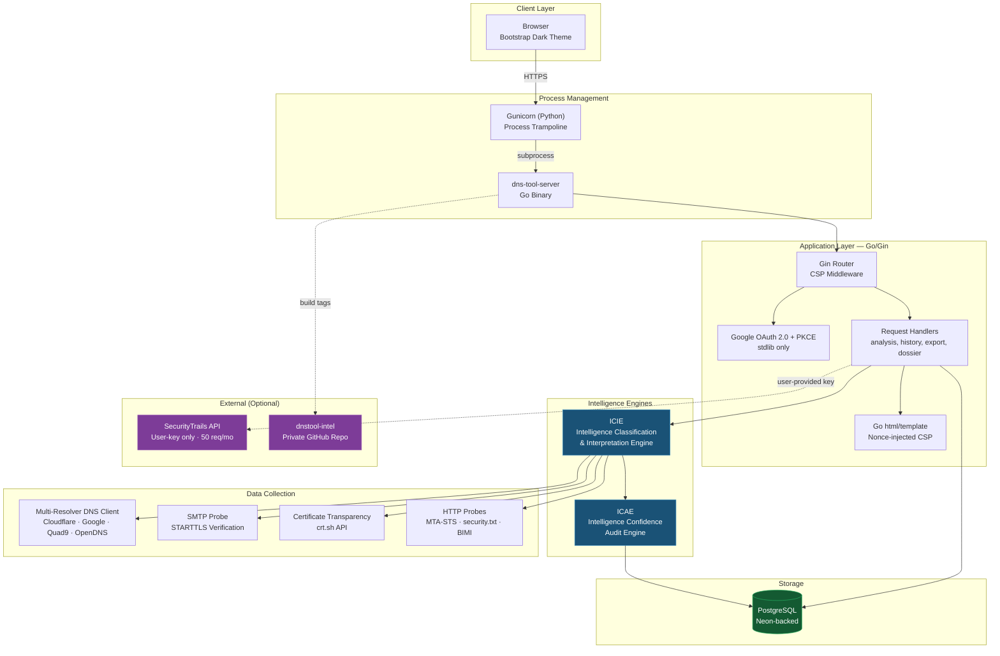
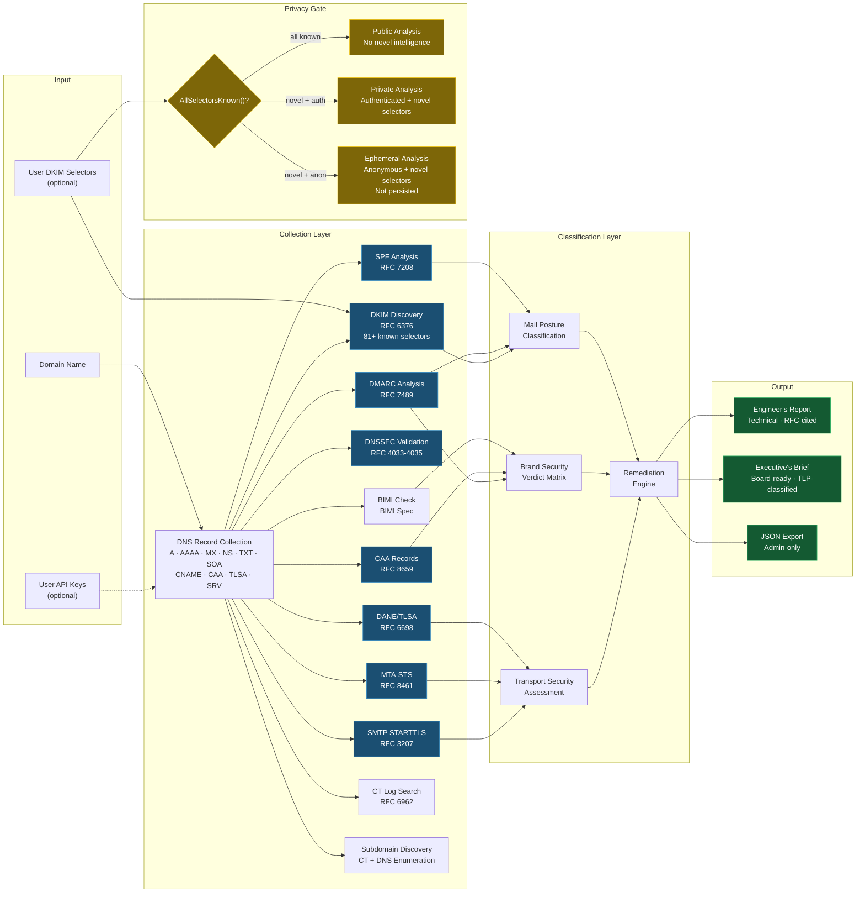
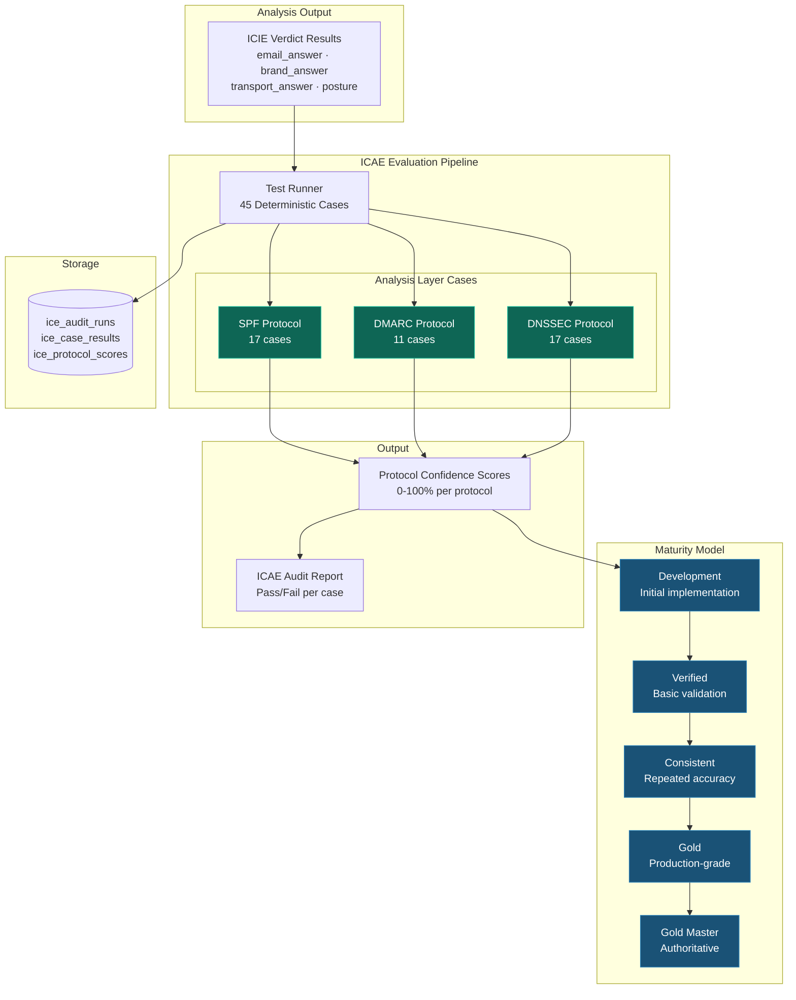
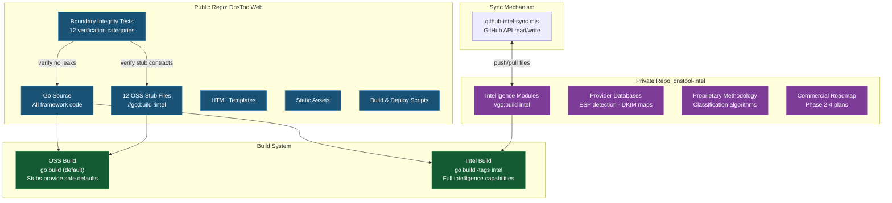
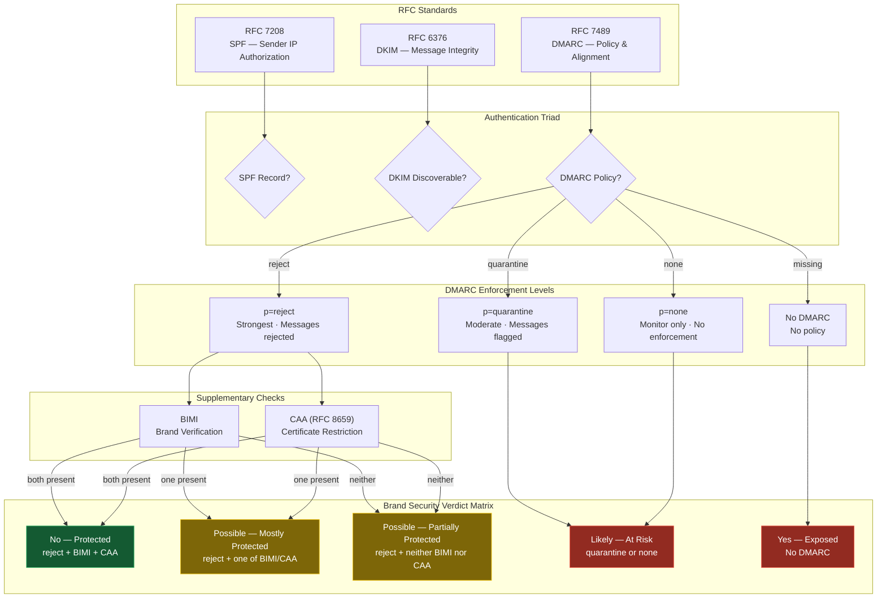
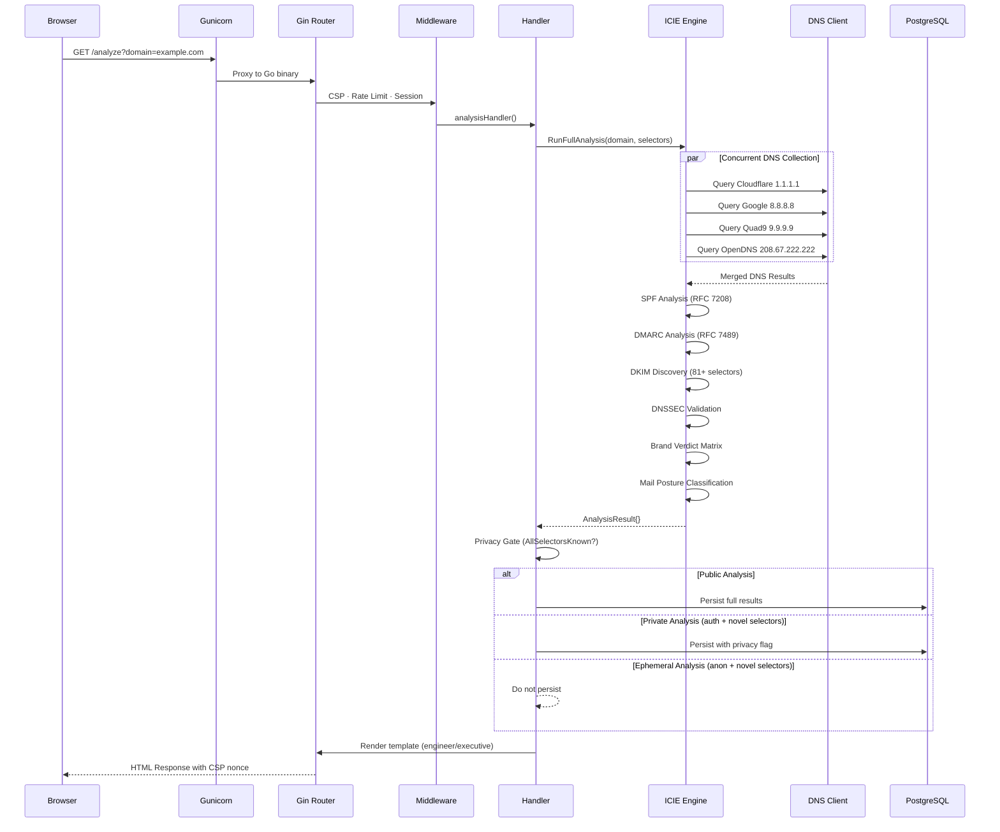
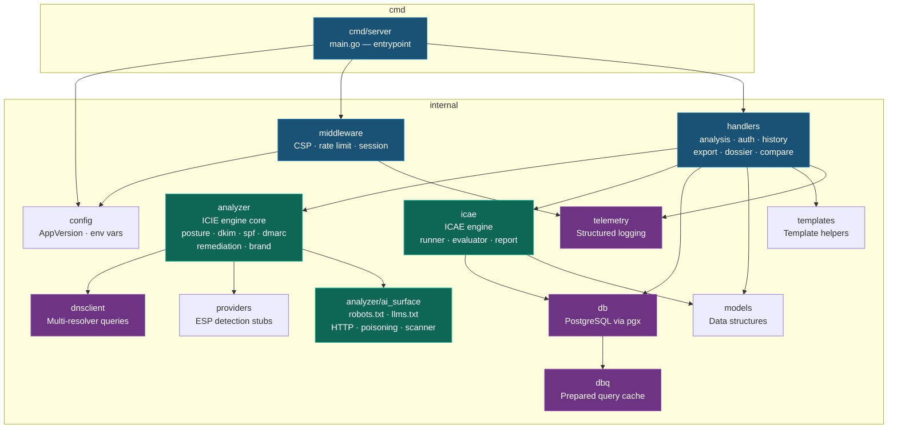

# DNS Tool — System Architecture

## 1. High-Level System Overview

## 2. ICIE — Intelligence Classification & Interpretation Engine

## 3. ICAE — Intelligence Confidence Audit Engine

## 4. Two-Repo Open-Core Architecture

## 5. Email Security Verdict Chain

## 6. Request Lifecycle

## 7. Package Dependency Map

---

*Generated for DNS Tool v26.20.73 — February 19, 2026*
*Diagrams render natively on GitHub, GitLab, Codeberg, and VS Code with Mermaid plugins.*
